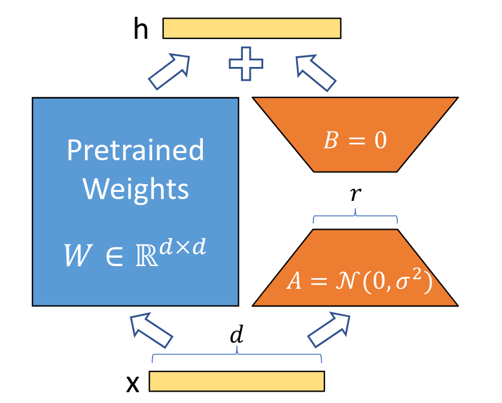

# LoRA: Low-Rank Adaptation of Large Language Models

## Motivation: The Fine-tuning Problem



Fine-tuning large language models presents significant challenges:

- **Parameter Inefficiency**: Fine-tuning requires updating all parameters (often billions)
- **Memory Requirements**: Storing optimizer states, gradients, and model copies demands substantial VRAM
- **Storage Overhead**: Each fine-tuned model requires saving a complete copy of all parameters
- **Training Cost**: Full fine-tuning is computationally expensive and time-consuming

## Enter LoRA: Parameter-Efficient Fine-tuning

LoRA (Low-Rank Adaptation) solves these challenges by recognizing that updates to pre-trained weights during fine-tuning have a **low intrinsic rank**. By low intrinsic rank we mean that when a large pre-trained model is fine-tuned for a specific task, the changes required in its weight matrices are structured and do not span the full high-dimensional space of the original weights. Instead of updating all weights directly, LoRA injects trainable rank decomposition matrices into the model.

### Core Concept: Low-Rank Decomposition

The key insight is that we can represent the weight update matrix as a product of two lower-rank matrices:

```math
\Delta W = B \times A
```

Where:

- Original weight matrix $W$ has dimensions $d \times k$
- $B$ has dimensions $d \times r$
- $A$ has dimensions $r \times k$
- $r$ << min($d, k$) (significantly lower rank than the original matrix)

The updated forward pass becomes:

```math
h = W x + \Delta W x = W x + B A x
```

### LoRA in Practice: Applying to Transformer Weights

LoRA typically targets specific weight matrices in the model:

- **Query and Key projections** in self-attention layers
- **Value projections** in self-attention layers
- **Output projections** after self-attention
- **Feed-forward network** weights

For each target weight matrix, we:

1. Freeze the original pre-trained weights $W$
2. Initialize low-rank matrices $A$ and $B$
   - A is initialized with random Gaussian values
   - B is initialized with zeros (ensuring no impact at the start)
3. Scale the contribution with a parameter $\alpha$
4. Apply the update during the forward pass: $Wx + \frac{\alpha}{r}(BA)x$

## Advantages of LoRA

- **Parameter Efficiency**: Only trains a small fraction of parameters (typically <1%)
- **Memory Efficiency**: Significantly reduced memory footprint during training
- **Storage Efficiency**: Can store multiple task adaptations with minimal overhead
- **Inference Efficiency**: LoRA matrices can be merged with original weights at inference time
- **Composition**: Multiple LoRA adaptations can be combined or swapped

## Mathematical Representation

### Standard Fine-tuning

During traditional fine-tuning, we update weights from W to W':

```math
W' = W + \Delta W
```

### LoRA Approach

With LoRA, we approximate the update using low-rank matrices:

```math
W' = W + \frac{\alpha}{r} BA
```

Where:

- $W \in \mathbb{R}^{d \times k}$ is the pre-trained weight matrix
- $B \in \mathbb{R}^{d \times r}$ and $A \in \mathbb{R}^{r \times k}$ are trainable low-rank matrices
- $r$ is the rank (hyperparameter, typically 4-64)
- $α$ is a scaling factor (hyperparameter)

### Training Process

1. Initialize $A$ with random Gaussian values: $A \sim N(0, σ²)$
2. Initialize $B$ with zeros: $B = 0$
3. Freeze the pre-trained weights $W$
4. Train only the parameters in $A$ and $B$
5. During inference, compute: $h = Wx + \frac{\alpha}{r}(BA)x$

## Hyperparameters

The most critical hyperparameters in LoRA are:

- **Rank ($r$)**: Controls the expressiveness of the adaptation (higher values = more capacity)
- **Alpha ($α$)**: Scales the contribution of the low-rank update
- **Target modules**: Which weight matrices to apply LoRA to
- **Learning rate**: Often higher learning rates can be used compared to full fine-tuning

## Performance Comparison

| Method           | Trainable Parameters | Memory Usage | Storage         | Training Time |
| ---------------- | -------------------- | ------------ | --------------- | ------------- |
| Full Fine-tuning | 100%                 | High         | Full model copy | Slow          |
| LoRA (r=8)       | <1%                  | Low          | Small adapter   | Fast          |
| LoRA (r=16)      | <1%                  | Low          | Small adapter   | Fast          |
| LoRA (r=32)      | <1%                  | Low          | Small adapter   | Fast          |

## In This Assignment

You will implement LoRA for your SmolLM model, focusing on:

1. Creating the LoRA adaptation layers
2. Freezing pre-trained weights
3. Applying LoRA to specific weight matrices
4. Training and evaluating the LoRA-adapted model
5. Comparing performance against full fine-tuning

## Additional Resources

### Original Paper

- [LoRA: Low-Rank Adaptation of Large Language Models](https://arxiv.org/abs/2106.09685) - Hu et al., 2021

### Video Explanations

- [LoRA explained (and a bit about precision and quantization)](https://www.youtube.com/watch?v=t509sv5MT0w) - Good introduction to LoRA
- [Fine-tuning LLMs with PEFT and LoRA](https://www.youtube.com/watch?v=Us5ZFp16PaU) - Practical walkthrough
